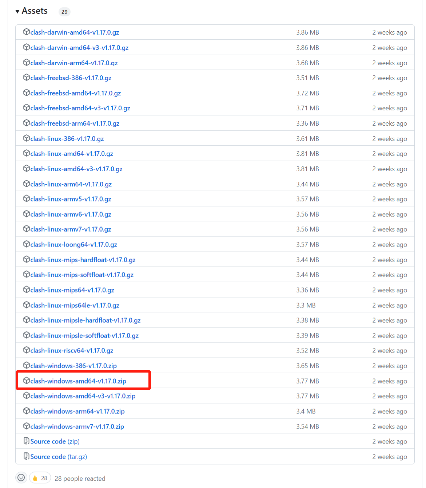
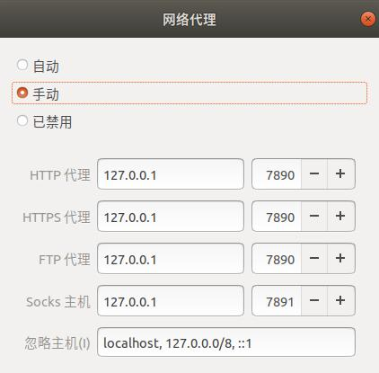

1、下载clash，选择clash-windows-amd64-v1.17.0.zip

https://github.com/Dreamacro/clash/releases



2、打开终端，解压压缩包，cd到该文件夹目录，运行./cfw，保持终端在后台运行

```
unzip clash-windows-amd64-v1.17.0.zip
cd clash-windows-amd64-v1.17.0
./cfw
```

3、修改网络代理设置



4、不使用clash代理上网时、需要修改网络代理为禁用